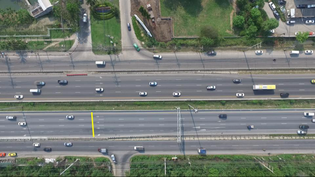

# Simple Vehicle Count - Counting Vehicles from a Stable Video (Drone)

This is a simple algorithm that I have developed for my Applied Machine Vision class project (2019). Simple and fun idea, but it needs lots of improvement to make it operational.

Basically this wills allow counting vehicles passing through a particular line. Here I use simple background extracting techniques (just with simple statistics) from a stable video which is very common and simple technique.

Steps in the process are explained below (Written in MATLAB\Octave). And class presentation explaining more detailed process is also included in this repository (__*./presentations/presentation.pdf*__).

- Step 1: Read Video and Defining Vehicle Counting Line
- Step 2: Extracting Pixels in Line and Stack in Time Direction
- Step 3: Extracting the background
- Step 4: Extracting moving objects by subtracting the background
- Step 5: Post-processing
- Step 6: Counting

### Step 1: Read Video and Defining Vehicle Counting Line

```Matlab

%%% Read Video
vid_name = 'DJI_0892.MP4';
vidObj = VideoReader(vid_name);
frm_temp = readFrame(vidObj); % reading temporary frame

%%% defining line, moving vehicles through this line will be counted
xmin = 561; xmax = 573; ymin = 687; ymax = 838;

%%% showing the line in a sample frame
frm_temp = insertShape(frm_temp,'Line',[xmin ymin xmax ymax],'LineWidth', 10);
figure, imshow(frm_temp) % visualizing the results

```



### Step 2: Extracting Pixels in Line and Stack in Time Direction

```Matlab

%%% Defining line as binary image as well, this makes pixel extraction easier
frm_line = zeros(size(frm_temp));
frm_line = insertShape(frm_line,'Line',[xmin ymin xmax ymax], 'LineWidth', 1, 'Color', 'white');
frm_line = frm_line(:,:,1)>=0.5;

%%% Going through each frame and extract pixel in interested line and stack them as a matrix
numFrames = floor(vidObj.Duration*vidObj.FrameRate);
line_stack = [];
for ii = 1:numFrames-1
	ii

	frm_curr = readFrame(vidObj);
	
	frm_curr_r = frm_curr(:, :, 1);
	frm_curr_g = frm_curr(:, :, 2);
	frm_curr_b = frm_curr(:, :, 3);
	

	r_line = frm_curr_r(frm_line)';
	g_line = frm_curr_g(frm_line)';
	b_line = frm_curr_b(frm_line)';
	
	rgb_line = cat(3, r_line, g_line, b_line);
	
	line_stack = cat(1, line_stack, rgb_line);
end

figure, imshow(line_stack) % visualizing the results

```


### Step 3: Extracting the background

```Matlab

%%% First convert to gray scale to run efficiently
line_stack_g = rgb2gray(line_stack);

figure, imshow(line_stack_g) % visualizing the results

```


```Matlab

%%% Perform moving median in time direction
line_stack_g_movm = movmedian(line_stack_g, 100, 1);

figure, imshow(line_stack_g_movm) % visualizing the results

```


### Step 4: Extracting moving objects by subtracting the background


```Matlab

%%% Subtracting background and scaling
line_stack_anm = abs(single(line_stack_g)-single(line_stack_g_movm));
line_stack_anm_scl = uint8(((line_stack_anm-min(line_stack_anm(:)))./(max(line_stack_anm(:))-min(line_stack_anm(:))))*255);

figure, imshow(line_stack_anm_scl) % visualizing the results
```


```Matlab

%%% Thresholding
line_stack_anm_bin = line_stack_anm_scl > 80;

figure, imshow(line_stack_anm_bin) % visualizing the results
```


### Step 5: Post-processing

```Matlab

%%% apply morphological processes as post-processing techniques
line_stack_anm_bin_clr = imdilate(line_stack_anm_bin, strel('line',9,90));
line_stack_anm_bin_clr = imerode(line_stack_anm_bin_clr, strel('disk',2));
line_stack_anm_bin_clr = imdilate(line_stack_anm_bin_clr, strel('line',9,0));

figure, imshow(line_stack_anm_bin_clr); % visualizing the results

```


### Step 6 - Counting

```Matlab

%%% finally counting vehicles
line_stack_anm_lbl = bwlabel( line_stack_anm_bin_clr ); % converting gray image to label image
max(unique(line_stack_anm_lbl))' % print unique labels , corresponding to number of vehicles

figure, imshow(label2rgb(line_stack_anm_lbl)); % visualizing the results

```


__*41 Vehicles Counted ( and Actual Number is 44) !*__
